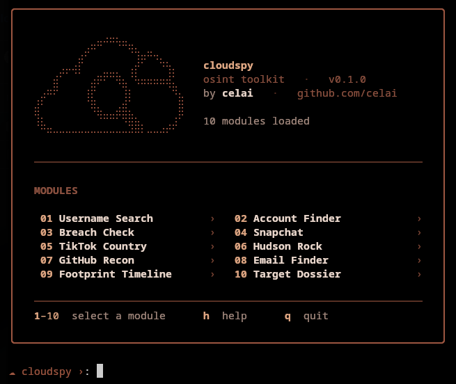

<div align="center">

# cloudspy

**Modular OSINT toolkit with a clean terminal interface.**

One username or email in - a full identity out.

[](https://www.python.org/)
[](LICENSE)
[](#requirements)



</div>

---

## Overview

cloudspy bundles ten reconnaissance modules behind a single menu-driven interface.
Each module takes one identifier and pulls what it can from public sources - accounts,
breaches, infostealer records, profile data. The flagship module, **Target Dossier**,
chains all of them together: give it one seed and it crawls outward, pivoting on every
new username, email, or handle it discovers until it has assembled a complete picture.

Everything runs locally. Every source is public and keyless.

## Features

| # | Module | What it does |
|:---:|:---|:---|
| 01 | **Username Search** | Trace a username across thousands of sites and networks |
| 02 | **Account Finder** | Find accounts registered to an email address or phone number |
| 03 | **Breach Check** | Check an email's breach exposure and test a password against known leaks |
| 04 | **Snapchat** | Recover the masked email / phone behind a Snapchat account |
| 05 | **TikTok Country** | Resolve a TikTok username to its account region |
| 06 | **Hudson Rock** | Look up infostealer infections tied to an email or username |
| 07 | **GitHub Recon** | Profile intelligence and public commit-email harvesting |
| 08 | **Email Finder** | Discover and verify a person's email from their name and a domain |
| 09 | **Footprint Timeline** | Reconstruct historical and deleted presence from web archives |
| 10 | **Target Dossier** | Recursive crawler - build a full identity from a single seed |

## Requirements

- **Python 3.10 or newer** (3.11 / 3.12 recommended)
- A terminal that supports Unicode and 256 colours (most modern terminals do)
- Roughly 300 MB of disk for the optional headless browsers

## Installation

### Quick start

If you already have Python and Git:

```bash
git clone https://github.com/celai/cloudspy.git
cd cloudspy
python -m venv .venv && source .venv/bin/activate
pip install -r requirements.txt
playwright install chromium firefox
python main.py
```

### Step by step

<details>
<summary><b>1. Install Python</b></summary>

<br>

**Windows**

```powershell
winget install Python.Python.3.12
```

Or download the installer from [python.org](https://www.python.org/downloads/) and tick
*"Add Python to PATH"* during setup.

**macOS**

```bash
brew install python
```

(Install [Homebrew](https://brew.sh/) first if you don't have it.)

**Linux**

```bash
# Debian / Ubuntu
sudo apt update && sudo apt install python3 python3-venv python3-pip git

# Arch
sudo pacman -S python git

# Fedora
sudo dnf install python3 python3-pip git
```

Confirm it worked:

```bash
python --version
```

</details>

<details>
<summary><b>2. Get the code</b></summary>

<br>

```bash
git clone https://github.com/celai/cloudspy.git
cd cloudspy
```

No Git? Download the ZIP from the [repository page](https://github.com/celai/cloudspy),
extract it, and `cd` into the folder.

</details>

<details>
<summary><b>3. Create a virtual environment</b></summary>

<br>

A virtual environment keeps cloudspy's dependencies separate from your system.

```bash
python -m venv .venv
```

Activate it:

```bash
# Linux / macOS
source .venv/bin/activate

# Windows (PowerShell)
.venv\Scripts\Activate.ps1
```

</details>

<details>
<summary><b>4. Install dependencies</b></summary>

<br>

```bash
pip install -r requirements.txt
```

The Snapchat and TikTok modules drive a headless browser. Install the browser
engines once:

```bash
playwright install chromium firefox
```

</details>

## Usage

Start cloudspy from the project folder:

```bash
python main.py
```

or

```bash
python -m cloudspy
```

Pick a module by number and follow the prompts.

### Controls

| Key | Action |
|:---:|:---|
| `1`-`10` | Select a module |
| `h` | Show help |
| `b` | Go back (inside a module's sub-menu) |
| `q` | Quit |
| `Enter` | Return to the menu after a result |

### Examples

```
☁ target (email or username) › amelia_stone     # Target Dossier - full crawl
☁ username › amelia_stone                        # Username Search
☁ target email › amelia@example.com              # Account Finder / Breach Check
☁ full name › amelia stone   domain › acme.com   # Email Finder
☁ username, email, or domain › amelia_stone      # Footprint Timeline
```

> **First run:** the Username Search and Target Dossier modules download a site
> database the first time they run, so the first scan takes a little longer. This
> is a one-time step.

## Target Dossier

The reason cloudspy exists. Hand it a single username or email and it runs a
breadth-first identity crawl:

1. It queries every relevant source at once - a fast direct check across 20+ sites,
   plus GitHub, GitLab, Reddit, Keybase, Gravatar, Hudson Rock, breach data and more.
2. Anything it finds - a real name, a second email, a linked handle, an avatar - is
   fed back into the queue and crawled again.
3. It keeps going, wave after wave, until the identity graph stops growing.

The result is one report: names, confirmed profiles, faces, linked accounts, breach
and infostealer exposure, and the exact pivot trail that connects them - scored from
*faint* to *full identity*.

## Project layout

```
cloudspy/
├── main.py                    entry point
├── requirements.txt
└── cloudspy/
    ├── core/                  menu loop, interface, theme, registry
    ├── modules/               the ten recon modules
    │   └── workers/           isolated browser / scanner subprocesses
    └── utils/                 shared HTTP helpers
```

## Disclaimer

cloudspy is built for authorised security research, education, and personal privacy
audits - checking your own exposure, or testing with explicit permission. It only
touches publicly available information.

You are responsible for how you use it. Respect local laws, platform terms of service,
and other people's privacy. The author assumes no liability for misuse.

## License

Released under the [MIT License](LICENSE).

---

<div align="center">

Made by [**celai**](https://github.com/celai)

</div>
